# Journey Sand
A Unity project to remake the scene in Journey.

********

A demo image for the scene in the project :

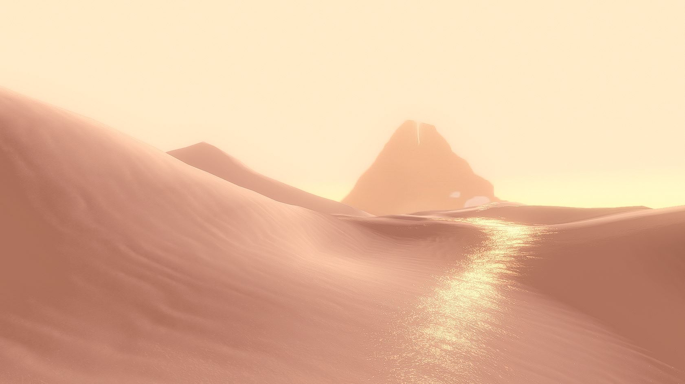

The reference scene from Journey :

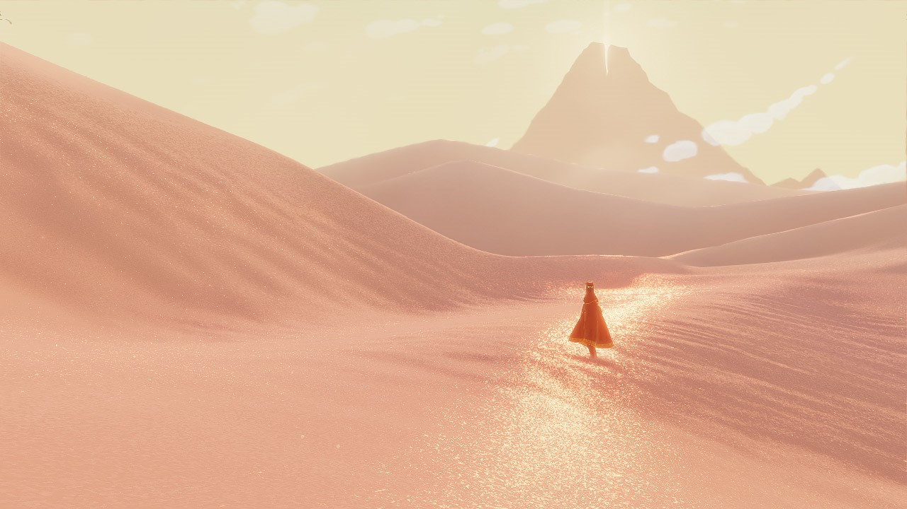

(Image Source: GDC Vault 2012 - https://www.gdcvault.com/play/1017742/Sand-Rendering-in)

## Diffuse

A modified Oren Nayar model is implemented :

## Height map(Normal map)

The terrain is separated into X-direction and Z-direction.

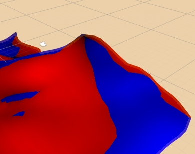

Normal map in X and Z direction is applied to different orientations.

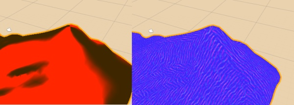

TBN convert the normal to correct direction

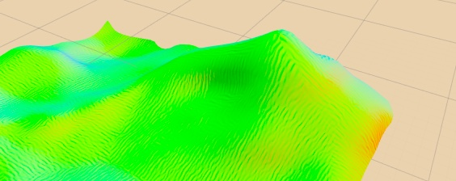

The overall effect :

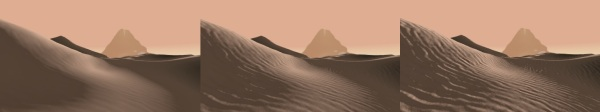

## Specular

Well, simply, it is Bilnn-Phong model. I also tried the PBR but there is just a very vague improvement.

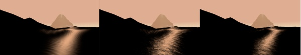

## Glitter

Not 100% sure what the noise function is uesd. Here is a fake effect to simulate the one in Journey.

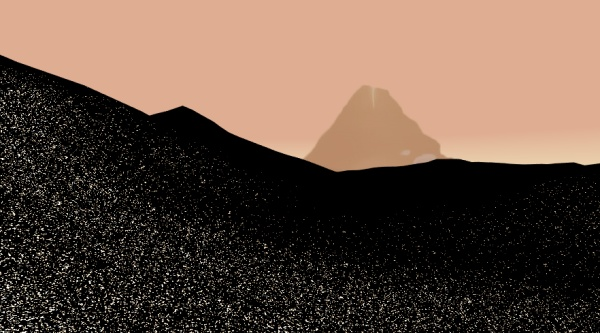

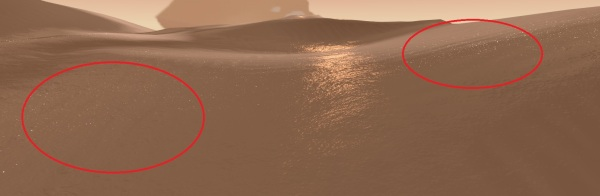

******

## Post Effect

The result without any screen-base effect:

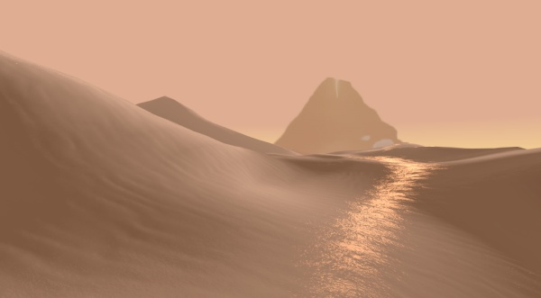

Add Bloom: (Post Processing Stack)

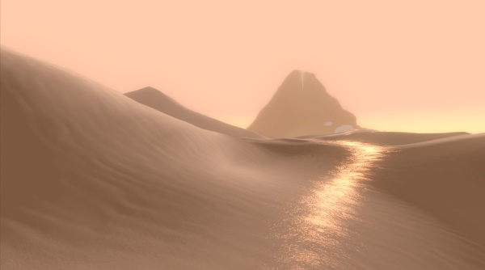

Add Tone map and LUT :(Post Processing Stack)

Add Sharpen and saturation : (Beautify https://assetstore.unity.com/packages/vfx/shaders/fullscreen-camera-effects/beautify-61730)

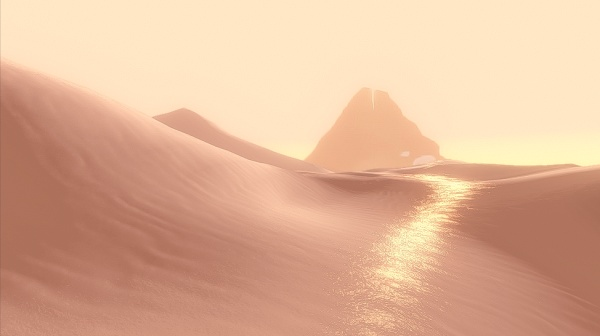

******

## License

